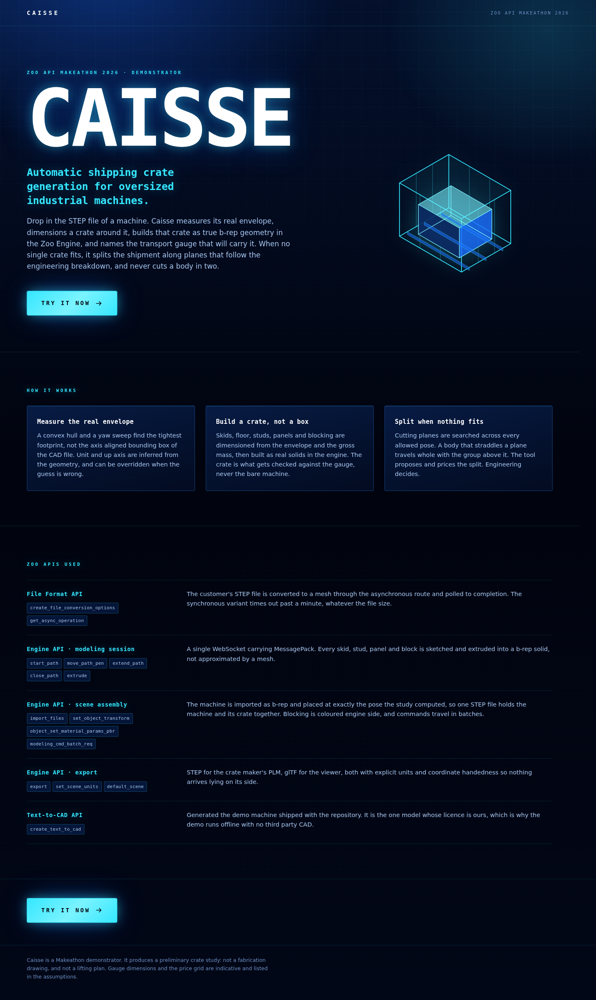
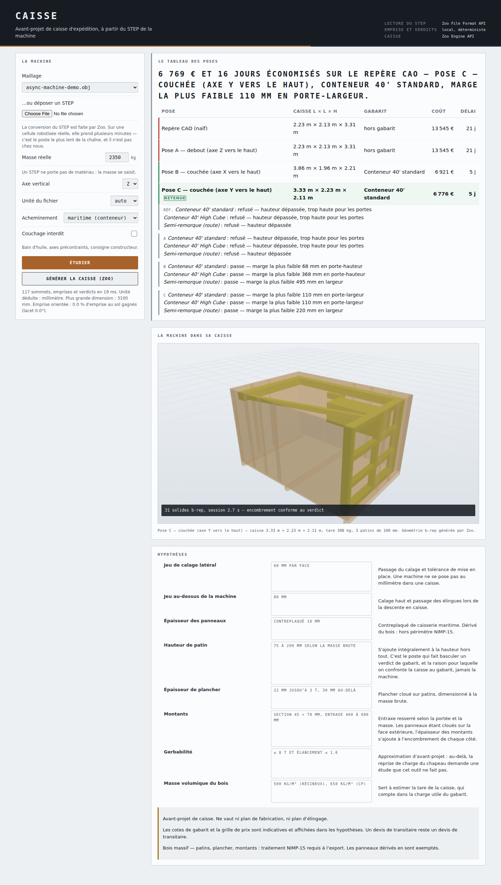
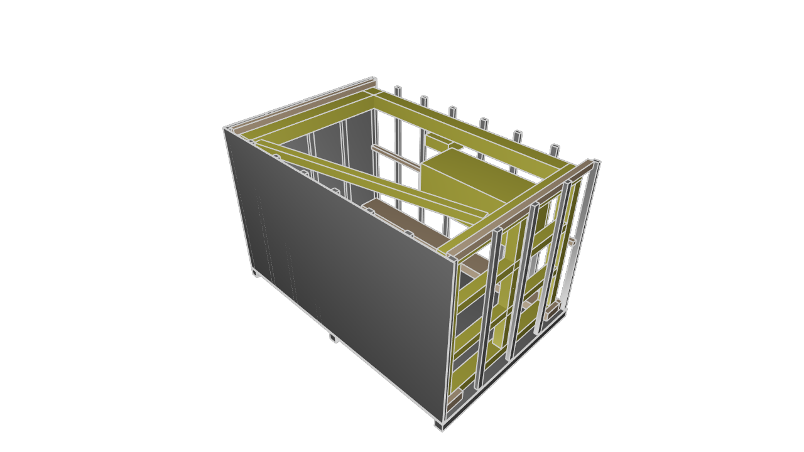

# AutoCrate ✕ Zoo.dev

**Drop in the STEP file of a machine. Four seconds later, know whether its
shipping crate fits in a container — and what it costs if it doesn't.**

Built for the [Zoo API Makeathon](https://zoo.dev/events/api-makeathon), a fully virtual
makeathon running 22 July to 5 August 2026.





---

## The problem

A special-machine builder ships 5 to 50 unique machines a year. Nobody models
the crate: someone sketches it on a sheet of A4, the crate maker comes to
measure, and the crate comes out oversized "to be safe". It is packaging, not
product — nobody has time to open a CAD package for it.

The real cost is not the cubic metres of air being shipped. It is **crossing a
threshold**: three centimetres too much and you go from a standard 40-foot
container to a flat rack, or to an oversize road convoy. That is a multiplier on
price, and — worse — a multiplier on **lead time**. For a machine builder,
missing a shipping window costs more than the freight itself.

And nobody sees it until the crate has already been ordered, which is to say
until it is too late.

## What this does

You drop in the machine's STEP file — or a mesh, if you already have one — and
enter its mass. Four seconds later you
get a **crate pre-design**: the real footprint, the generated crate
structure, and a table of orientations with a gauge verdict, a cost and a lead
time for each.

It does not decide for you. It shows you that **laid on its side, the machine
fits a standard container**.

On the demo machine — 2.0 × 1.9 × 3.1 m, 2 350 kg:

| Orientation | Crate L × W × H | Gauge | Cost | Lead time |
|---|---|---|---|---|
| CAD frame (naive) | 2.25 × 2.15 × 3.33 m | **out of gauge** | 13 639 € | 21 days |
| A — upright | 2.25 × 2.15 × 3.33 m | **out of gauge** | 13 639 € | 21 days |
| B — laid on X | 3.88 × 1.98 × 2.23 m | 20' standard | 5 618 € | 5 days |
| **C — laid on Y** | **3.35 × 2.25 × 2.13 m** | **LCL groupage** | **3 766 €** | **12 days** |

**9 873 € and 9 days saved per machine.** And because the cheapest option is
also the slowest, the tool refuses to decide for you:

> Faster: 20' standard, 5 472 € in 5 days — seven days less for 1 706 € more.
> Up to you what the shipping window is worth.

The interesting part is *where* the money is. Comparing the naive box against
the same crate shipped in a full container:

| Cost line | Upright | Laid down | Delta |
|---|---|---|---|
| Building the crate | 1 852 € | 1 661 € | −191 € |
| Volume shipped (m³) | 504 € | 475 € | −29 € |
| **Threshold crossing** | **11 000 €** | **2 400 €** | **−8 600 €** |

**98 % of the gain comes from the threshold.** The cubic metres of air saved are
worth 29 €. That is the whole thesis of the project, verified on a real file:
the money is not in the volume, it is in the step function.

### The detail that would have wrecked it

The crate clears the container doors by **110 mm**. The bare machine is 2 000 mm
wide, which against a 2 340 mm door opening looks like a comfortable 340 mm of
margin. Blocking, studs and panels add 230 mm. Compare the *machine* to the
gauge instead of the *crate*, and you turn a 110 mm squeak into a false sense of
safety. This is why the tool always confronts the crate — never the machine.



## Where Zoo does the work, and where we do

```
Zoo — File Format API   reads the customer's STEP, returns a mesh
our code                vertices → oriented footprint, poses, verdicts, costs
Zoo — Engine API        builds the crate as b-rep, exports the common STEP
Zoo — ML / Text-to-CAD  generated the demo machine (see "Demo file" below)
```

**Zoo does no simulation and no business logic.** What makes this a Zoo showcase
rather than a Python script is that the generated geometry is **the consequence
of other geometry**: we consume the customer's CAD, measure it, compute, build
around it, and emit STEP that goes back into their PLM.

Three capabilities no three.js can replace, and which the project therefore
exercises end to end: **import real STEP**, **generate b-rep**, **export STEP**.

Timed end to end, twice in a row, on the demo machine:

```
reading the STEP (File Format API)       1.24 s  Zoo
footprints, poses, crate, verdicts       0.02 s  us
session open + b-rep import              1.37 s  Zoo
building the crate, placing the machine  0.13 s  Zoo
exporting the common STEP and the glTF   1.78 s  Zoo
─────────────────────────────────────────────────
total                                    4.55 s     (then 4.56 s)
                                         99 % Zoo, 1 % us
```

`out/bout-en-bout.step` contains **the machine and the crate in one file**: 32
solids, the customer's b-rep and ours, in the same scene.

## Running it

```bash
git clone <this repo> && cd ZOO_Hackaton_Caisse
./script.sh          # installs, converts the demo machine, opens the workshop
```

Then open <http://localhost:5174>.

You need Node 20+ and a Zoo API token in `.env` (`ZOO_API_TOKEN=…`, from
<https://zoo.dev/account/api-tokens>). `script.sh` creates the file and tells you
if the token is missing rather than letting you discover it on the first call.

```bash
./script.sh demo       # the full chain in the console, timed post by post
./script.sh test       # 51 unit tests
./script.sh verifier   # drives the workshop in a real browser, fails on any console error
```

## How it works

**Oriented footprint.** A STEP file is modelled in an arbitrary frame. An
axis-aligned bounding box on a machine drawn askew is visibly too big. We
project the vertices onto the horizontal plane, take the 2D convex hull, then
sweep 180 rotations at 0.5° and keep the smallest area. The vertical axis never
moves, so height is free. No rotating calipers: brute force at half a degree is
exact at the precision that matters and fits in thirty readable lines.

**Three poses, not six.** The six permutations of a triplet only make sense for
a box aligned to the file's axes. Once yaw is optimised, the (length, width)
permutation is already absorbed by the sweep. What remains is which machine axis
points up. Flipping 180° changes no dimension. Plus **one reference line** — the
naive box in the CAD frame. That is not a fourth pose, it is the *before*.

**The crate.** Skids sized to the mass, floor, stud spacing by span, plywood
panels. Boxes only — no booleans, no fillets, no real joinery. Rules of thumb,
parameterised and displayed on screen as assumptions. Never a timber
calculation note.

**Blocking, against where the machine actually is.** A bounding box is not
enough — and neither is a single slice. Laid on its side, our demo machine
touches the floor over a 160 mm strip at one end: a stop placed anywhere else
along that same wall bears on the crate and on nothing else. It looks like a
chock and is not one.

So the placed mesh is cut into **columns**, and each column is measured
separately. A stop is only placed in a column where the machine is actually
present at that height, and it runs from the wall to the machine *as measured in
that column*. Where the machine is not, there is no chock. Verified on the demo
machine: every stop that should bear on the part does, to within 5 mm.

**Clearance is a sum, and the sum is shown.** 70 mm per face is 45 mm of side
rail plus 25 mm of placement tolerance; 95 mm above is 70 mm of top batten plus
the same 25 mm. Blocking that fills the entire clearance leaves nothing to lower
the machine through — on paper it no longer fits its own crate. That mistake
was in the code for a day.

**And the blocking is weighed and priced.** Wood in the chocks is roughly 40 kg
on the demo machine and the tare feeds the payload check, so leaving it out
understated the gross mass. The estimate used for the tare is deliberately
conservative — it assumes the heavy case — and the geometry actually drawn stays
under it.

**No three-metre blocks.** When a machine sits far from a wall, the gap is
closed with two pieces and a void between them, the way a crate maker does it.
Before that fix one chock came out 3 000 mm deep in solid timber.

This is a **blocking principle**: position and envelope, nothing else. No bill of
materials, no nailing pattern, no section justified by a calculation. And it
does not say where the machine may be pushed against — a sheet-metal cover and a
cast-iron frame look alike in a mesh. Without material and an assembly tree you
block against the envelope, and you say so. The crate maker stays in the loop.

No diagonal bracing either: real bracing is oblique, and our model only produces
axis-aligned boxes. Rather than calling a horizontal member "bracing", we place
what we actually place — a mid-height side rail that stiffens the panel.

**Yaw minimises width, not area.** This is not a detail. The verdict never
depends on floor area: it depends on one dimension, the one that touches the
gauge. Height is fixed by the pose, length only binds at twelve metres — width
is all yaw can act on. Minimising area is a proxy, and it betrays: on the demo
machine it gives 3100 × 1900 where minimising width gives 3635 × **1725**. On
the KUKA those 111 mm are the difference between a 40-foot container and a
truck.

**Five gauges, two cost regimes.** LCL groupage, 20' and 40' standard, 40' High
Cube, road trailer. Groupage is not a container, it is a **pricing regime**: you
pay per cubic metre, not per box. It is also the first threshold a builder
shipping five machines a year actually meets — long before a flat rack. The
gauge retained is the cheapest **in total**, not the one with the smallest flat
fee, since those are no longer the same thing.

**The verdict is an `if`.** Container and trailer dimensions are constants.
Door opening and internal height are checked **separately**, because a load can
fit the volume and not clear the doors. Best value-for-effort in the whole
project. Any clearance under 50 mm is reported as *passes narrowly, confirm with
the crate maker* — nineteen millimetres is a warped panel or a nail head.

**A payload refusal is invariant under orientation.** 45 t in a one-cubic-metre
crate is a mass problem: no pose fixes it and neither does a flat rack. The tool
says so in one sentence instead of showing a pose table that implies otherwise.

**If nothing fits**, both outcomes are priced: out-of-gauge (flat rack, OOG,
special convoy) and splitting into two crates. **The tool does not split.** It
does not read the assembly tree and does not decide the split — that is an
engineering decision that does not belong to it. It prices both and lets you
choose.

**But it can say what costs.** PROJECT.md called the assembly tree "the trap of
the project" because product hierarchy does not survive the import path — and
that is true, the names come out as `Unnamed-0`, `Unnamed-1`. **The grouping
survives, though**: fifteen bodies for the demo machine, thirty-seven for a KUKA
robot. Names are lost, bodies are not, and naming pieces is not what is needed
here — geometry is.

So when nothing fits, the tool tries cutting planes from the top down and
reports which bodies stick out. On the demo machine standing upright:

> Three bodies out of fifteen carry the overrun. Cut at 2.00 m and shipped
> separately: main crate 2.25 × 2.15 × 2.11 m, second crate 3.19 × 2.25 ×
> 0.38 m, **7 156 € in 19 days** — against 13 639 € and 21 days out of gauge.

It still does not decide. A distinct body in a mesh is not a removable part: it
may be a weld, or a converter artefact. The tool says which ones cost; the
engineering department rules.

**And before announcing an oversize convoy**, it checks the other shipping mode:
on one test machine no container fitted, but a standard trailer cleared by
21 mm. Announcing 20 205 € of special convoy there would have been wrong.

## Reused from my first Makeathon project

Written by me during the same window, for the BESS configurator, and reused
here as-is. Declaring it is the honest thing to do and costs nothing:

| File | What it is |
|---|---|
| `src/engine/session.ts` | Engine API WebSocket transport: batching, the undocumented heartbeat, MsgPack decoding of exports |
| `src/engine/box.ts` | sketch-and-extrude of a box |
| `src/zoo-client.ts` | authentication |
| `public/style.css` | the stylesheet |

`session.ts` has two additions made for this project, both marked in the source:
`reserveIds()`, needed to build a batch whose commands reference each other, and
cleanup of the pending entry when serialisation throws — see FEEDBACK #6.

## Demo file, and why it is generated

The rules require a public submission and a public video, so the licence of the
demo file is not a detail. We checked, and the check eliminated every candidate:

| Repository | Licence | Verdict |
|---|---|---|
| `tpaviot/pythonocc-demos` | **none** | not redistributable |
| `NTNU-manulab/Cobots-RoboDK-Isaac-Sim` | **none** | not redistributable |
| `Nhsrico/gltf-models` | **none** | not redistributable |
| `qunat/Pythonocc-vericut` | LGPL-3.0 | parts under 40 cm, no threshold crossed |
| `csbebetter/OCC_Qt_Robot` | **MIT** | KUKA KR 6 — 88 cm, no threshold crossed |

The general finding: **a machine big enough to cross a gauge threshold is a
machine whose CAD belongs to its manufacturer.** Every freely licensed model we
found is under one metre, and a one-metre crate fits everywhere — there is
nothing left to demonstrate.

So the demo machine is **generated by Zoo Text-to-CAD** (`npm run machine-demo`,
prompt in `src/machine-demo.ts`, KCL in `fixtures/machine-demo.kcl`). No rights
question, a third flagship API in the project, and a geometry chosen for what it
has to demonstrate. The tool itself knows nothing of this: it receives a STEP
and measures it.

The KUKA KR 600 R2830 stayed as the **API measurement file** — most of
`FEEDBACK.md` comes from it — but it is neither committed nor shown.
See [`fixtures/README.md`](fixtures/README.md).

## What we found in the Zoo APIs

[`FEEDBACK.md`](FEEDBACK.md) holds 12 entries written as the frictions were hit,
not reconstructed afterwards. The three that cost us the most:

- **#9 — a sketch's Z coordinate is silently ignored**, so everything extrudes
  from zero. A crate stacked flat still *looks* like a crate; we only caught the
  missing 115 mm by measuring the solids in the exported glTF. On a crate whose
  verdict turns on 110 mm, that is the difference between right and plausible.
- **#4 — the File Format API switches to async on file size (25 MB), while the
  gateway times out on conversion time (~60 s).** The two are uncorrelated: a
  1.51 MB file fails where a 2.15 MB file succeeds. The naked 504 carries no
  operation id, so there is no way to recover the job.
- **#8 — an imported mesh cannot be re-exported in any format**, by `export` or
  `export3d`, and one non-b-rep entity fails the export of every other one.

## Limits, stated plainly

- **The oriented footprint gains nothing on the files we had.** 0 % on the demo
  machine, 1.8 % on the KUKA: both are drawn aligned to their own axes. The
  algorithm is right — it recovers 2000 × 800 from a box rotated by 37°, and the
  tests prove it — but the "your CAD is in an arbitrary frame" argument did not
  pay off on any real file we got our hands on. The demonstration rests on the
  poses, where the gap is large.
- **Prices and gauge dimensions are indicative** and displayed with their
  values. A freight forwarder's quote remains a freight forwarder's quote.
- **No centre of gravity, no inertia tensor, no timber structural calculation,
  no non-rectangular envelope.** Skids are sized to mass alone, which is the
  trade rule anyway.
- **The tool produces a crate pre-design.** It is not a fabrication drawing and
  not a lifting plan. That statement is in the output, not only in this README.
- **ISPM-15** applies to the solid timber only — skids, floor, studs. Panel
  products are exempt. Also stated in the output.

## Demo video

One-minute walkthrough: **<VIDEO_LINK>**

The shot list, the exact figures to show and the three things not to say are in
[`docs/video.md`](docs/video.md). The public post is drafted in
[`docs/post.md`](docs/post.md).

## Repository map

| Path | What is in it |
|---|---|
| `src/moteur/` | the pure engine: crate sizing, gauge verdicts, costs, lead times. No CAD, 19 tests |
| `src/geometrie/` | oriented footprint, poses, unit and vertical-axis guards, placement. 20 tests |
| `src/engine/` | Zoo Engine API: session, boxes, batched scene, crate layout. 6 tests |
| `src/mesh/` | OBJ reading and compaction, glTF re-measurement. 6 tests |
| `src/serveur.ts` + `public/` | the workshop: pose table and 3D view |
| `src/bout-en-bout.ts` | the whole chain, timed post by post |
| `tools/verifier-ui.mjs` | drives the workshop in a real browser, fails on any console error |
| `FEEDBACK.md` | 12 notes on the Zoo APIs |
| `fixtures/README.md` | demo file, licence audit, measurement files |

## Licence

MIT. See [`LICENSE`](LICENSE).

Code comments are in French, the author's working language. Everything a reader
needs — this README, `FEEDBACK.md`, the assumptions and disclaimers shown in the
product — is in English.
# Zoo_Makeathon-Autocrate
# Zoo_Makeathon-Autocrate
# Zoo_Makeathon-Autocrate
